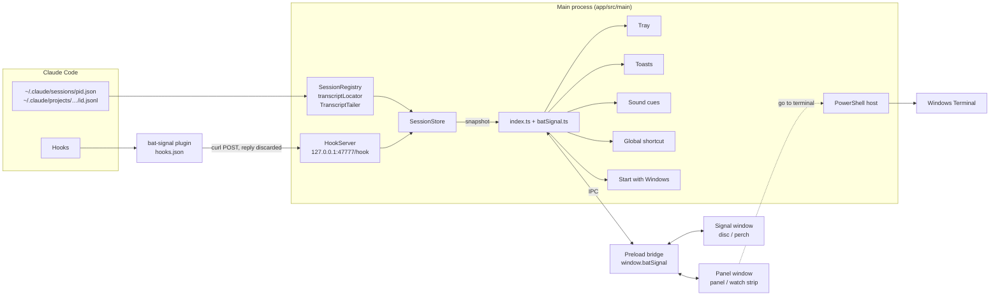

# Architecture

Bat-Signal is a Windows Electron app that watches your Claude Code sessions from a corner of the screen. It reads what Claude Code already writes under `~/.claude/` and, when the plugin is installed, what Claude Code's hooks report the moment they fire. It turns both into one snapshot: the live sessions ("cases" in the UI), what each is doing, and what needs you. It never acts on a session. The plugin's hooks post each event to a local HTTP server from a background command that discards the reply, so whatever answers can't decide anything for Claude Code (`plugin/bat-signal/hooks/hooks.json`).

## The two sources

**Files (always on).** Three classes in `app/src/main/sources/` read Claude Code's own files:

- `sessionRegistry.ts` watches `~/.claude/sessions/` (a file watcher plus a 5-second poll) and reads only the `<pid>.json` files. It never opens the `*.key` files beside them, which hold secrets. An entry counts as live only if its process is running and started when the file says it did, because Windows reuses pids and a crashed session leaves its file behind. Start times come from `windowsProbe.ts`, which runs one `powershell.exe` per batch of pids and caches the answers. Each entry carries the session's `busy`, `idle` or `shell` status.
- `transcriptLocator.ts` finds `~/.claude/projects/<folder>/<sessionId>.jsonl`. The folder is the cwd with every non-alphanumeric character turned into `-`. If that misses, it scans every project folder, at most once every 30 seconds per session (`DEEP_SCAN_EVERY_MS` in `store.ts`). It also lists subagent transcripts in `<sessionId>/subagents/`.
- `transcriptTailer.ts` reads only what was appended since the last read, in 1 MB chunks, and only complete lines. If the file shrank or was replaced, it says `restarted` and the store rebuilds that session from the start.

The store re-reads every transcript every 2 seconds (`REFRESH_MS` in `app/src/main/batSignal.ts`). That alone keeps the window current.

**Hooks (with the plugin).** `plugin/bat-signal/hooks/hooks.json` subscribes to 14 events. Each one is a background command (`"async": true`) that posts the event with `curl.exe` to `http://127.0.0.1:47777/hook`, gives up after a second, discards the reply and exits with `0`, so Claude Code never waits and never gets a decision back. `HookServer` takes only `POST /hook` with a JSON body under 1 MB, and refuses any request with an `Origin` header or a `Host` other than `127.0.0.1`/`localhost`, so a web page can't post to it. It answers `204` before it handles the event. After each hook the store reads that session's transcript, and reads it again 300 ms later (`AFTER_HOOK_REREAD_MS`), because Claude Code can fire a hook before it writes the matching line. `HOOK_EVENTS` in `app/src/main/model/hookSignals.ts` must match `hooks.json`; `app/test/plugin.test.ts` checks it. See [docs/plugin.md](plugin.md) for what each event is used for.

**How they combine.** The two sources mostly fill different fields, so there is little to arbitrate:

- Transcripts give the session's content: title, messages, tasks, subagents, background commands.
- The registry gives which sessions exist and whether each is busy.
- Hooks give the live signals no file records: a pending permission prompt, Claude waiting for input, a turn that failed.

They overlap on one fact, the end of a turn. A `Stop` hook records it directly. For a session that has sent no hook, the store treats the registry's flip from `busy` to `idle` as the end of the turn, after waiting 3 seconds (`FLIP_GRACE_MS`) for a `Stop` hook that would win. Such a session is listed in `snapshot.unheard`. Any hook from it later removes it from that list. Hooks can also arrive before the registry lists a session. They are kept, and dropped after 5 minutes if the session never shows up.

**Without the plugin**, Bat-Signal still lists sessions with their tasks, subagents and background commands, sees replies through the busy-to-idle flip, and flags stalled tasks. It can't show permission prompts, waits or errors. The Needs you list says so when the plugin is silent (`PluginHint`, driven by `pluginSilent` in `app/src/shared/view.ts`). Only one running Bat-Signal can bind port 47777. If the port is taken, the hook server logs a warning and that instance works from files alone.

## The store and the model

`SessionStore` (`app/src/main/store.ts`) joins the three inputs. It keeps one entry per live session, mirrors the registry (`setLiveSessions`), reads transcripts (`refresh`), applies hooks (`handleHook`), and records when the user opened a case (`markSeen`). It emits `update` only when something visible changed. This is cheap to check because the reducers return the same object when a line changes nothing. A session's transcript is read by one read at a time, with at most one read queued behind it, so a hook and the timer never apply the same lines twice. `ready` resolves after the first registry listing, and nothing is published before it. A half-read state would otherwise look like news.

The model lives in `app/src/main/model/` and is pure:

- `sessionReducer.ts`: `applyTranscriptLine` folds transcript lines into a `TrackedSession`. A custom title beats an AI title. Only the last 20 messages are kept. **Tasks** come from `TaskCreate`/`TaskUpdate` results, each with a status history. **Subagents** come from `Agent` calls. **Background jobs** come from `Bash` calls that return a `backgroundTaskId`. Runs finish on `TaskStop` or a `<task-notification>`. `applySubagentLine` adds a subagent's latest reply from its own transcript. The reducer's bookkeeping (`pending`) never leaves the main process: `toSessionState` strips it.
- `hookSignals.ts`: `applyHookEvent` folds a hook payload into `SessionSignals` (`pendingPermission`, `waitingSince`, `error`, `lastStopAt`).
- `attention.ts`: `deriveAttention` turns sessions into `AttentionItem`s of kind `permission`, `error`, `waiting`, `reply` or `stalled` (an in-progress task, in a session that is not busy, where neither the task nor the session has moved for 30 minutes), sorted by `ATTENTION_URGENCY`. A `waiting` or `reply` item the user has already seen (`seenAt`) is left out.

What leaves the store is a `StoreSnapshot` (`app/src/shared/types.ts`): `sessions` (one `SessionSnapshot` per case), `attention` (the Needs you list) and `unheard`. Snapshots are pushed at most every 100 ms, and re-pushed every minute because `stalled` depends on the clock.

**Notices** are news, found by comparing two snapshots: `diffNotices` in `app/src/shared/notices.ts`. A notice is a new alert (any kind except `stalled`), a `task-done`, a `session-opened` or a `session-closed`. Each has a stable `key`, so the same news is never announced twice. The first snapshot announces nothing, because it is the starting state, not news. Two consumers diff snapshots on their own: the signal page, for its notice cards (`app/src/shared/noticeQueue.ts`), and the main process, for toasts and sound (`app/src/shared/announcer.ts`).

**Themes** are listed in `app/src/shared/themes.ts`: by id (the film or comic, the key `settings.json` keeps), with what code needs from each (its demo flag, the window's ground, its words, its emblem from `app/src/shared/emblems.ts`). A Theme's colors and faces are in its stylesheet, `app/src/renderer/src/styles/themes/<id>.css`, scoped to `<html data-theme>`, and its fonts in `<id>.fonts.ts` beside it; the pages find both by file name. The main process opens both windows with `?theme=` and paints the panel's background in the Theme's ground, so the first frame already wears it. `main.tsx` sets the attribute and loads the Theme's fonts (`styles/themes/fonts.ts`, one chunk per Theme) before the first render. `Wearing` (`app/src/renderer/src/theme.ts`) provides the settings' Theme to both pages and keeps the attribute in step, so a change of Theme reaches both windows at once; the main process watches `settings.json` (`jsonFile.watch`), so editing it by hand applies at once too; components read it through `useTheme()`, `useWords()` and `useEmblem()`. A demo page wears the Theme its hash names (`#demo-vengeance`).

**Words** live in one catalogue, `app/src/shared/words.ts`, in the two parts `CONTEXT.md` names: the Terms a Lexicon may rename (Case, Needs you, the stamps, the states) and the Voice, every other line. A Voice line that names a term is a function of the Terms. The shared presenters (`attentionCopy`, `reportCopy`, `caseHeader`, `watchRow`, `ago`, `diffNotices`) take the words as a required argument, so no caller can fall back on the standard words by forgetting them. The panel and the Signal pass theirs through `useWords()` (`app/src/renderer/src/words.ts`). The announcer passes `STANDARD_WORDS`, and the tray reads `TRAY_WORDS`, so Windows notifications and the tray always speak the standard words. `app/test/uiText.test.ts` fails on UI text written in a component or in other shared code.

## The main process

`app/src/main/index.ts` wires it all up. `startBatSignal` (`batSignal.ts`) starts the sources and store, and hands each snapshot to the windows, the tray and the announcer. With `BAT_SIGNAL_DEMO` set, it serves made-up sessions from `app/src/shared/demo.ts` instead.

- **Windows and modes.** `BatSignalWindows` (`window.ts`) owns two frameless windows that hang from one bottom-right anchor. The *signal* window is transparent and shows the disc, which grows when a notice card comes out. The *panel* window shows the panel or the watch strip. The `WindowMode` is `signal`, `panel`, `watch` or `hidden`, and the `MODES` table says what each mode does with the two windows. In `watch`, the signal window becomes Bat-Clawd's click-through perch on the strip's top edge. `modes.ts` maps user actions (`shortcut`, `trayClick`, `trayShowHide`, `close`, `fold`, `summon`) to the next mode. It is pure, so it is tested without windows. Always-on-top is re-asserted every 3 seconds, because Windows' screenshot overlay can demote the window. The anchor, the panel size and which view the disc opens are saved in `window.json`.
- **Tray.** `tray.ts` draws what `trayMenu.ts` (pure) decides: the icon is lit while anything needs you, the tooltip gives the count, and the menu offers Show/Hide, Disc/Panel/Watch strip, Settings… and Quit. The tray is created before anything can hide the windows, since it is the way back.
- **Toasts, sound and the announcer.** `announce` (`app/src/shared/announcer.ts`) is pure. It finds fresh notices and returns the ones the user enabled for a toast (per group: `needsYou`, `reply`, `taskDone`, `sessions`) and the ones that make a sound. It returns nothing while the panel is the focused window. `burst.ts` gathers 500 ms of news into one burst. `toasts.ts` shows one silent Windows toast per burst: the most urgent notice, plus a count of the rest. Clicking a toast opens the panel on that case. `cues.ts` plays one sound per burst (the spotlight, `light`), never two within 4 seconds, and none while `quiet.ts` reports that Windows wants quiet (full screen, presenting, quiet time). The main process only picks the sound. It sends `cue` to the signal window, which plays it (`app/src/renderer/src/cues.ts`).
- **Global shortcut.** `shortcut.ts` holds the accelerator from settings (default `Ctrl+Alt+B`) through Electron's `globalShortcut`. It reports `off`, `active` or `taken`, and retries a taken one every minute. It pauses while the settings sheet records a new one.
- **Start with Windows.** `startup.ts` and `loginItem.ts` (pure). Windows' login entry is the only record of this choice, so nothing goes in `settings.json`. The entry launches with `--hidden`. Whether Task Manager has blocked it is read from the registry with `reg.exe`. The state is `on`, `off` or `blocked`.
- **Identity.** `identity.ts` gives the installed app the id `com.lucasmoont.bat-signal` and a development run `com.lucasmoont.bat-signal.dev`. The id is used for the taskbar, the toasts and the login entry's name. So a checkout runs beside the installed app and never takes over its login entry.
- **Single instance.** `index.ts` takes Electron's single-instance lock. A second launch summons the running app, unless it is the `--hidden` launch at sign-in. A development run uses `<userData> Dev` as its user-data folder (unless `--user-data-dir` is given). The lock lives with that folder, so the installed app and a checkout each run once.
- **Settings and the user data folder.** `settings.json` and `window.json` live in Electron's user-data folder, through `jsonFile.ts`. Every read is validated (`parseSettings`), writes are debounced by 500 ms, and a pending write is flushed at `before-quit`. Renderer changes arrive as patches, validated key by key (`applySettingsPatch`). On first run, `userData.ts` copies both files from the old `batcave` folder (installed) or from the installed app's folder (development). Live state that is not a choice, the shortcut status and the startup state (`AppStatus` in `app/src/shared/status.ts`), is never saved. It is pushed to the pages only when it changes.

## The renderer

Both windows load the same page, `app/src/renderer/index.html`, with `?view=signal` or `?view=panel` (`load` in `window.ts`). `main.tsx` reads `isSignalView` from `bridge.ts` and renders either `<Signal />` or `<App />`.

- **Signal** (`components/Signal.tsx`): the disc with its needs-you count. It diffs snapshots itself to queue notice cards (6 seconds each, most urgent first), asks main to grow the window for a card, and plays sounds. In `watch` mode it renders Bat-Clawd on the perch.
- **App** (`App.tsx`): reads the mode and renders `WatchStrip` for `watch`, or the full panel otherwise. The panel has the Needs you and Cases tabs, the case detail, the drawers and the settings sheet. The `report` layout swaps in `NightReport`. While `hidden`, it keeps the last view mounted.

Pages get state only through the preload bridge (`app/src/preload/index.ts`), exposed as `window.batSignal` with `sandbox` and `contextIsolation` on. `hooks.ts` reads each value once and then subscribes to its push channel. The main process sends every snapshot to the signal window, but to the panel window only while it is shown. Every argument a page sends is checked in `index.ts` or `batSignal.ts` before use. Outside Electron, or with `#demo…` in the URL, `bridge.ts` swaps in a stand-in that serves demo data.

Channels (keys of `IPC` in `app/src/shared/ipc.ts`, each sent as `bat-signal:<name>`):

- Pushed by main: `snapshot`, `settings`, `status`, `mode`, `focusCase`, `openSettings`, `cue`.
- Asked by pages (`invoke`): `getSnapshot`, `getSettings`, `getStatus`, `getMode`, `goToTerminal`, `noticeOut`.
- Sent by pages: `markSeen`, `setSettings`, `setMode`, `reopen`, `hide`, `interactive`, `moveSignal`, `watchHeight`, `warmTerminal`, `recordShortcut`, `setStartWithWindows`, `refreshStatus`.

## Going to the terminal

The terminal button calls `goToTerminal` (`app/src/main/sources/windowsTerminal.ts`). It runs two scripts in the shared PowerShell host:

1. A survey. Inline C# (`Add-Type`) reads the process table (Toolhelp32) and every visible titled window (`EnumWindows`), and UI Automation reads each Windows Terminal window's tab titles. The script walks up the session's process ancestors until it reaches one that owns a window.
2. A focus script. It restores the window if minimized, taps Alt so Windows lets a background process take the foreground, calls `SetForegroundWindow`, and selects the tab.

`terminal.ts` (pure) picks the target. A Windows Terminal tab titled with the session's name wins, ignoring the status glyph Claude Code puts in front. This also covers a terminal started from the Start menu, whose shell does not descend from Windows Terminal. Failing that, the nearest ancestor that owns a window is used, and the walk stops at system processes. If no window is found, or anything fails, `claude --resume <sessionId>` goes on the clipboard, and the result is `copied` instead of `focused`.

`powershell.ts` keeps one `powershell.exe -Command -` open for the app's lifetime. Starting PowerShell costs about 270 ms, and Windows' process queries are slow until warm, so a fresh process per click took about 3 seconds. Scripts run one at a time, each sent as one base64 line with a unique end marker. A script that takes longer than 10 seconds kills the host, and the next request starts a fresh one. The host is warmed ahead of time when the pointer reaches a terminal button (`warmTerminal`) and when sound is on (`warmQuiet`), since the quiet check shares it. `windowsProbe.ts` deliberately uses its own `powershell.exe`, so a slow pid lookup can't hold up the quiet check.

## Packaging and release

`electron-vite` builds `app/src/` into `app/out/`, and `electron-builder` (the `build` key in `app/package.json`) packs it into an unsigned NSIS installer. See "Building the installer" and "Releasing" in [CONTRIBUTING.md](../CONTRIBUTING.md) for the commands, the installer check CI runs, and how a version tag becomes a GitHub release.

## Where to start reading

1. `app/src/main/index.ts`: startup, the single-instance lock, and every IPC handler that is not about data.
2. `app/src/main/batSignal.ts`: how the sources, the store and the timers are wired.
3. `app/src/shared/types.ts`: the snapshot shape everything else passes around.
4. `app/src/main/store.ts`: how files and hooks become one snapshot.
5. `app/src/main/model/sessionReducer.ts`, `hookSignals.ts`, `attention.ts`: the rules, all pure and tested in `app/test/`.
6. `app/src/shared/notices.ts` and `announcer.ts`: what counts as news, and who hears it.
7. `app/src/main/window.ts` with `modes.ts`: the two windows and the modes.
8. `app/src/renderer/src/main.tsx`, then `Signal.tsx` and `App.tsx`: the two views.
